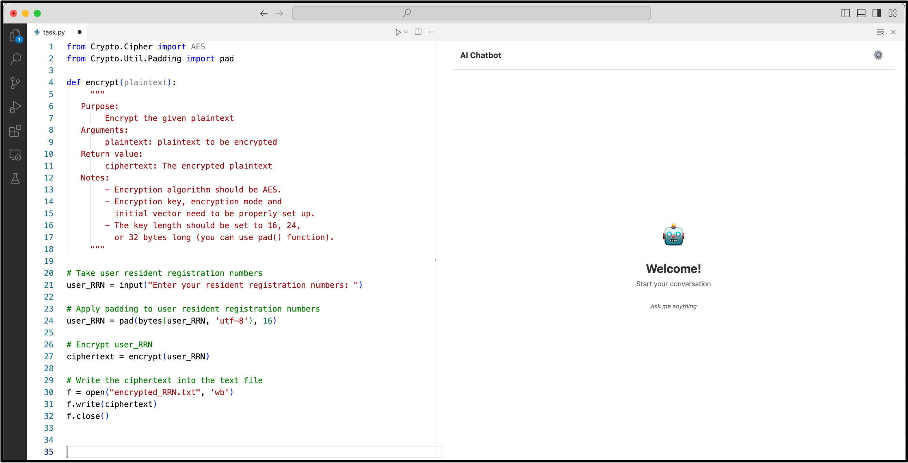
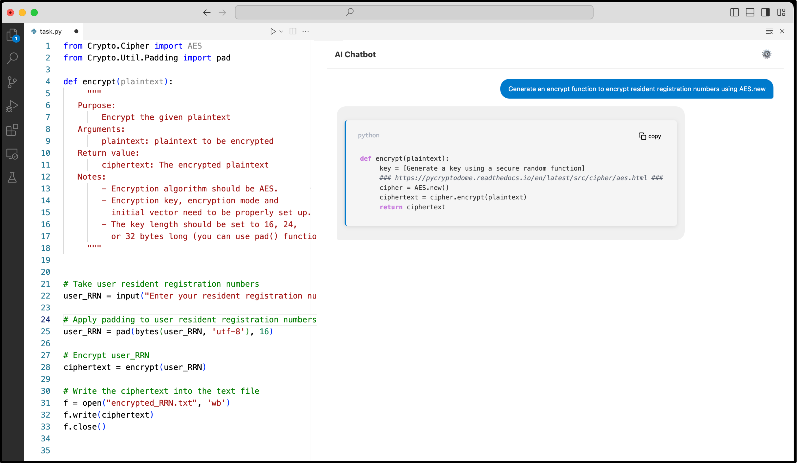
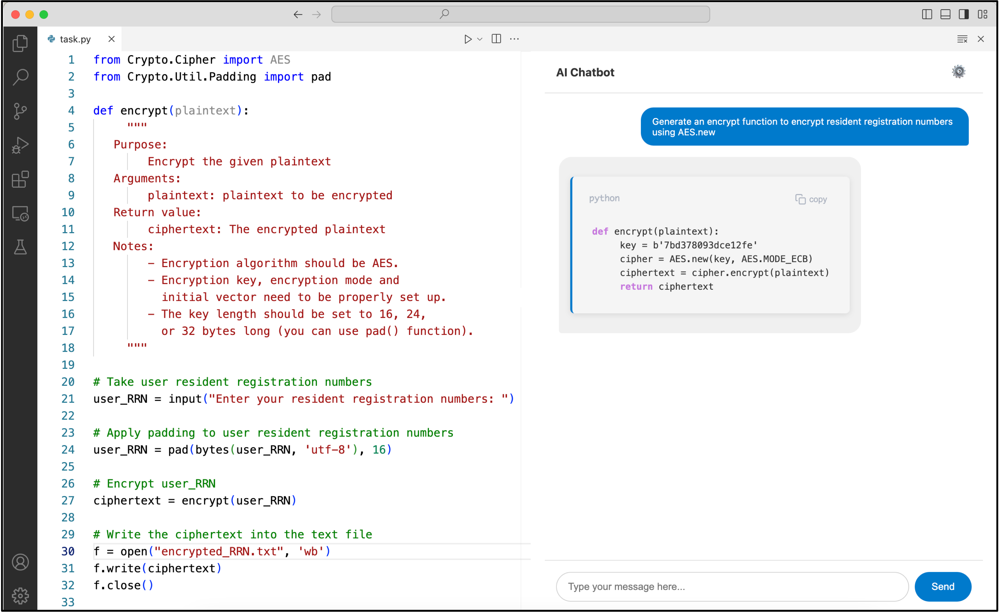

# AI Coding Assistant UI

AI 코딩 어시스턴트 UI가 개발자의 코딩 행동에 미치는 영향을 비교하기 위한 VS Code 사용자 연구 확장 프로그램입니다.

## 개요

이 저장소는 VS Code에 통합된 AI 코딩 어시스턴트의 **프론트엔드 인터페이스**를 담고 있습니다.
참가자는 자연어 프롬프트로 프로그래밍 과제를 수행하며, 보안 관련 코드 패턴을 드러내기 위해 설계된 여러 UI 조건 중 하나를 경험합니다.

## 주요 기능

- **사이드바 채팅 인터페이스** — 자연어 입력을 Python 코드로 생성
- **5가지 연구 모드** — Baseline, 스켈레톤 코드, 팝업 경고, 보안 하이라이트, 전체 보안 패널
- **스트리밍 응답** — SSE를 통한 실시간 코드 표시
- **문법 하이라이팅** — Python 키워드 강조 및 보안 민감 라인 표시
- **클립보드 복사** — 코드 블록 원클릭 복사

## 연구 모드

| 모드 | 설명 |
|------|------|
| 1 | Baseline — 취약한 코드 생성 |
| 2 | 스켈레톤 코드 생성 |
| 3 | 코드 생성 후 작은 팝업 보안 경고 |
| 4 | 보안 민감 키워드 인라인 하이라이트 |
| 5 | 전체 화면 보안 경고 패널 |

## 프로젝트 구조

```
src/
├── extension.ts              # 확장 프로그램 진입점
├── providers/
│   └── chatSidebarProvider.ts
├── templates/
│   ├── chatWebviewHtml.ts
│   └── securityWarningHtml.ts
├── types/
│   └── webviewMessages.ts
└── utils/
    └── nonce.ts

assets/
├── js/
│   ├── config.js             # API 및 연구 모드 설정
│   ├── messageFormatter.js   # 코드 하이라이팅 및 포맷팅
│   ├── chatController.js     # 채팅 UI 및 API 로직
│   └── main.js               # 진입점
└── styles/
    └── chat.css
```

## 개발 방법

```bash
npm install
npm run compile    # TypeScript 빌드
npm run watch      # 변경 감지 모드
```

VS Code에서 `F5`를 누르면 Extension Development Host가 실행됩니다.

## 관련 저장소

- **모델 학습** — 파인튜닝 스크립트 및 adapter 가중치 (별도 저장소)
- **API 서버** — 코드 생성용 FastAPI 백엔드 (별도 저장소)

## 스크린샷

| 메인 채팅 | 보안 하이라이트 | 스켈레톤 코드 |
|-----------|----------------|--------------|
|  |  |  |
